Ótima ideia\! Adicionar os diagramas de comportamento dinâmico (Sequência e Estado) ao `README.md` é o passo final para consolidar toda a documentação de modelagem do projeto. Isso enriquece a documentação, mostrando não apenas a estrutura, mas também como o sistema se comporta.

Abaixo está a versão atualizada do seu `README.md`, com uma nova seção dedicada a esses diagramas.

-----

# Zeni - Sistema de Gestão Financeira Pessoal

## 1\. Introdução

O projeto Zeni consiste no desenvolvimento de um aplicativo web de gestão financeira pessoal, projetado para oferecer uma ferramenta simples, intuitiva e eficiente. O objetivo principal é permitir que o usuário registre, organize e visualize suas finanças diárias, incluindo receitas, despesas e o gerenciamento de múltiplos cartões de crédito. O sistema busca apoiar o processo de tomada de decisão financeira do usuário, contribuindo para um maior controle e estabilidade econômica.

### 1.1. Justificativa

Grande parte da população enfrenta dificuldades na administração de suas finanças pessoais, seja pela falta de hábitos de organização ou pela limitação de ferramentas acessíveis que conciliem facilidade de uso com funcionalidades objetivas. O Zeni se justifica pela necessidade de uma solução que una simplicidade, design limpo e praticidade, atendendo ao público que deseja melhorar seu planejamento financeiro sem enfrentar barreiras de usabilidade.

## 2\. Autores

  * Douglas Luiz Pereira
  * Ketllen Cristiny Almeida do Nascimento
  * Maurilio Santos Semeão

## 3\. Escopo do Projeto

O desenvolvimento do projeto foi dividido em duas fases: um Produto Mínimo Viável (MVP) e evoluções futuras.

### 3.1. Escopo do MVP (Produto Mínimo Viável)

O MVP contempla as funcionalidades essenciais para que o sistema seja funcional e entregue valor ao usuário final.

  * **Registro de Receitas e Despesas:** Permitir o cadastro de transações com categorias personalizáveis.
  * **Gerenciamento de Cartões de Crédito:** Cadastro e gestão de múltiplos cartões de crédito.
  * **Associação de Despesas e Faturas:** Possibilidade de associar despesas aos cartões e visualizar faturas consolidadas.
  * **Limites de Gastos por Categoria:** Definição de limites de gastos para categorias específicas, com um sistema de alertas automáticos.
  * **Dashboard Interativo:** Apresentação de um painel com gráficos e resumos visuais para análise da saúde financeira.
  * **Exportação de Relatórios:** Geração de relatórios financeiros detalhados em formato Excel.

### 3.2. Escopo Futuro (Pós-MVP)

As funcionalidades abaixo foram planejadas para evoluções futuras do projeto:

  * Integração bancária para importação automática de transações.
  * Definição e acompanhamento de metas de poupança.
  * Aplicativo mobile para Android e iOS.
  * Funcionalidades de planejamento familiar compartilhado.
  * Notificações push e alertas mais personalizados.

## 4\. Modelagem de Negócio e Processos

Para a concepção do projeto, foram utilizados diagramas que ajudam a visualizar o modelo de negócio, os atores envolvidos e os fluxos de processo do sistema.

### 4.1. Lean Canvas

O Lean Canvas abaixo resume o modelo de negócio do Zeni, identificando a proposta de valor, segmentos de clientes, canais, fontes de receita e outros blocos estratégicos.

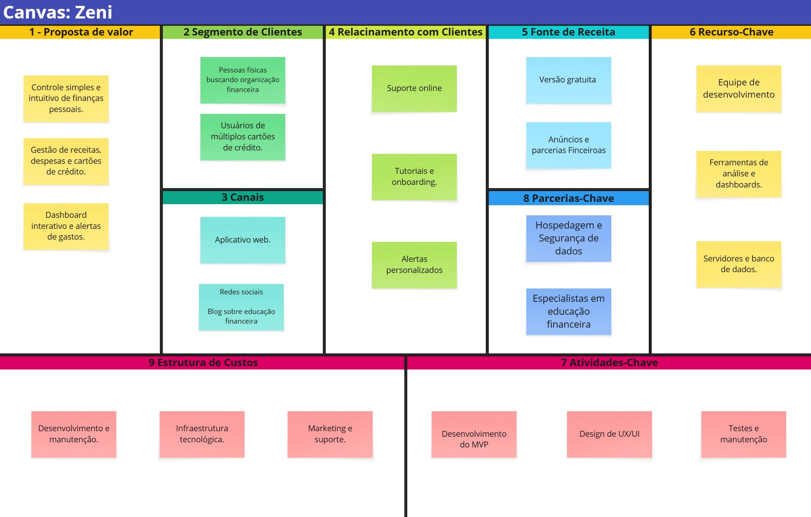

### 4.2. Diagrama de Casos de Uso

O diagrama a seguir ilustra as principais interações dos atores (Usuário, Administrador) com as funcionalidades do sistema Zeni.

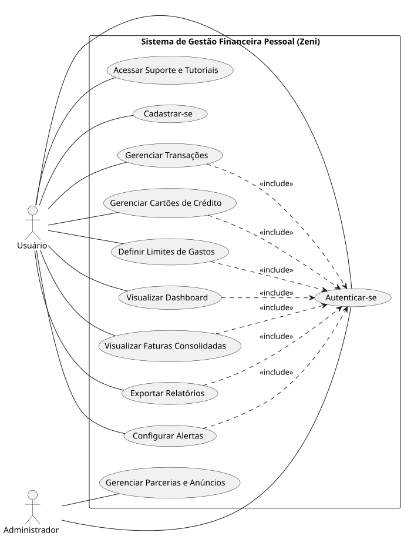

### 4.3. Diagrama BPMN (Processo de Negócio)

O diagrama BPMN detalha o fluxo do processo principal da aplicação financeira, desde o cadastro do usuário até o registro de transações e a visualização de relatórios.

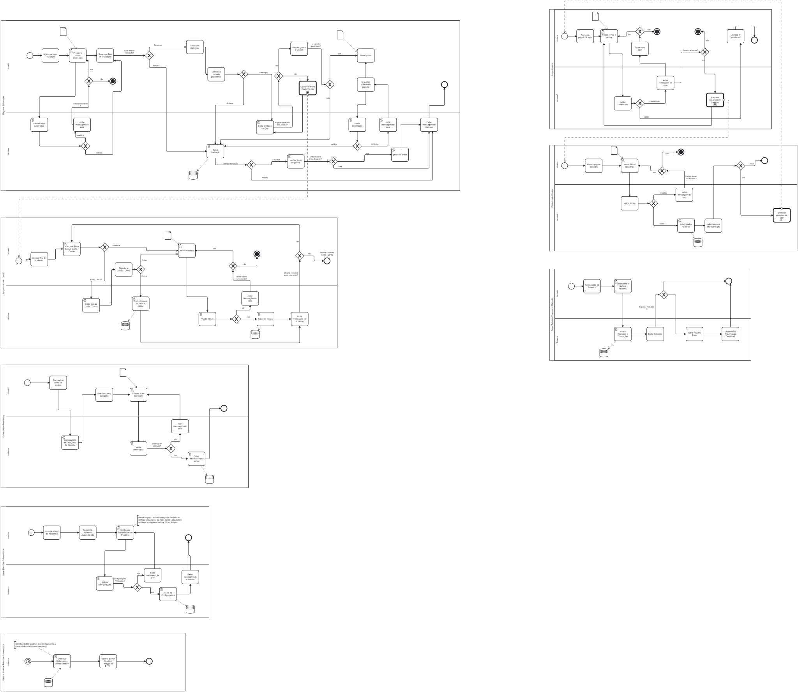

### ---BPMN Sub Processo Notificação Automatizada ---

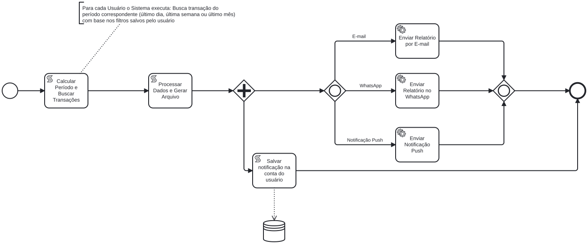

## 5\. Modelagem Comportamental (Diagramas Dinâmicos)

Os diagramas a seguir detalham o comportamento dinâmico do sistema, mostrando a interação entre objetos e o ciclo de vida de entidades complexas.

### 5.1. Diagramas de Sequência
Estes diagramas ilustram a ordem das interações entre os componentes do sistema para realizar funcionalidades específicas.

HU-03: Registrar Nova Transação
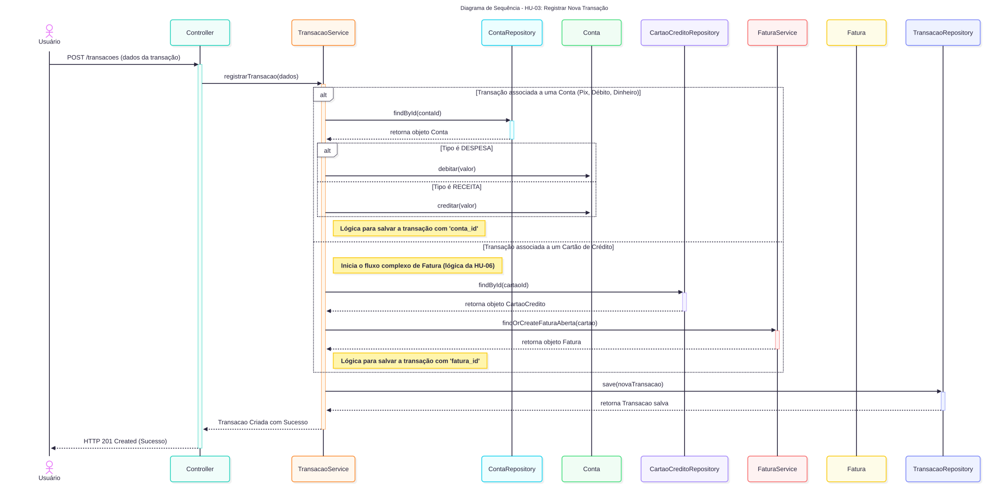

HU-04: Criar Categoria personalizada
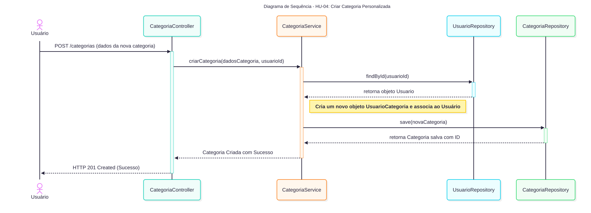

HU-06: Associar Despesa a Cartão de Crédito
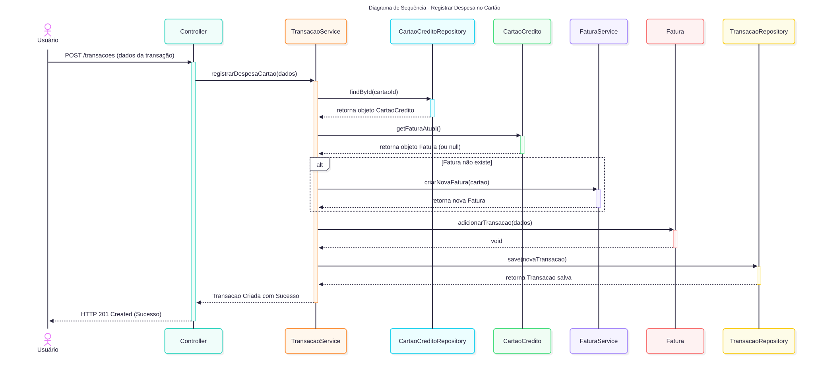

HU-09: Visualizar Dashboard
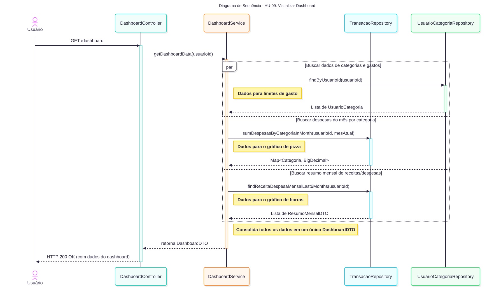

### 5.2. Diagrama de Estados

O Diagrama de Estados modela o ciclo de vida de um objeto, definindo todos os seus estados possíveis e as regras que causam as transições entre eles, como o ciclo de vida da Fatura.

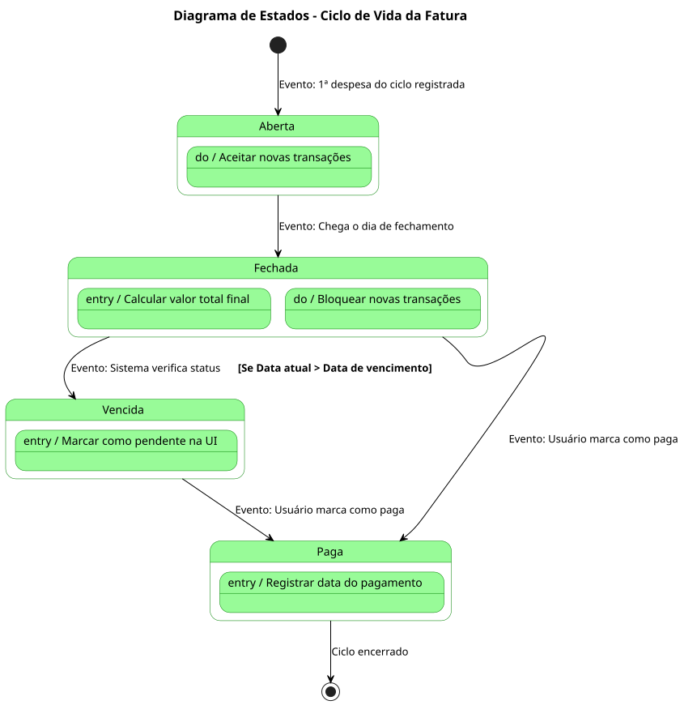

## 6\. Arquitetura e Modelo de Dados

A arquitetura do sistema foi projetada para ser modular e escalável, separando as responsabilidades em diferentes entidades.

### 6.1. Diagrama de Entidade-Relacionamento (DER)

O diagrama abaixo ilustra a estrutura do banco de dados, com as principais entidades e seus relacionamentos.

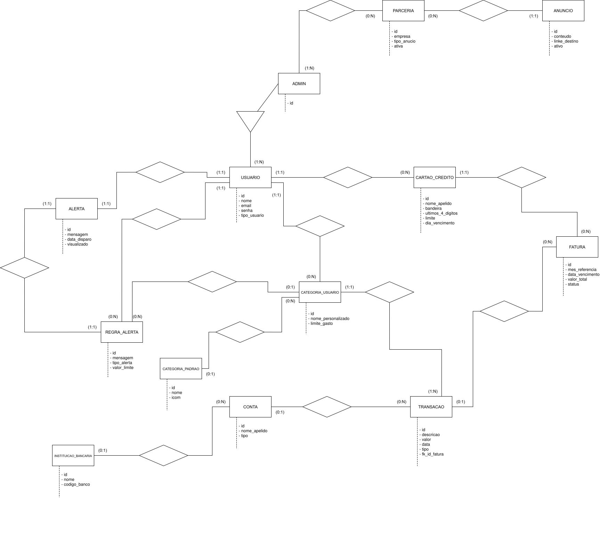

### 6.2. Diagrama de Classes

O Diagrama de Classes detalha a estrutura estática dos objetos do sistema, incluindo seus atributos, métodos e associações.

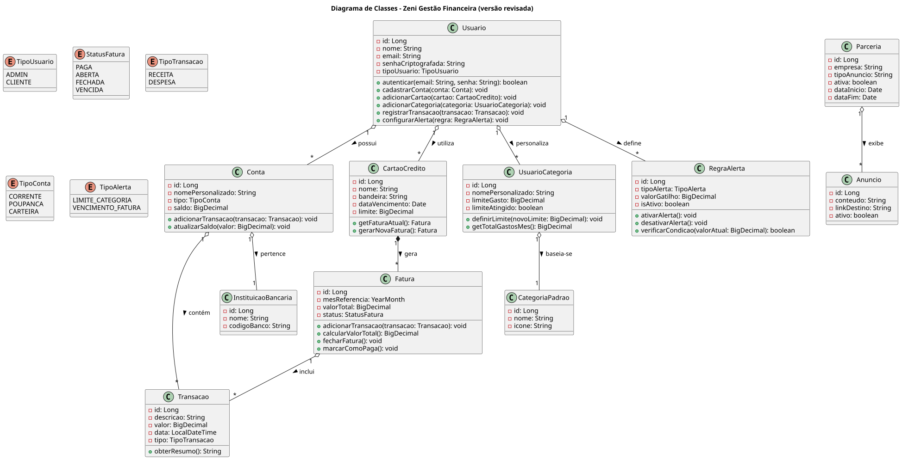

## 7\. Backlog do Produto (MVP)

O backlog a seguir detalha as funcionalidades do MVP, organizadas em Épicos e Histórias de Usuário, que guiarão o desenvolvimento.

### Épico 1: Gestão de Acesso e Perfil do Usuário

  * **HU-01:** Como um novo visitante, eu quero poder me cadastrar no sistema fornecendo meu nome, e-mail e senha.
  * **HU-02:** Como um usuário cadastrado, eu quero poder me autenticar no sistema usando meu e-mail e senha.

### Épico 2: Gerenciamento de Transações Financeiras

  * **HU-03:** Como um usuário autenticado, eu quero poder registrar uma nova transação (receita ou despesa).
  * **HU-04:** Como um usuário autenticado, eu quero poder criar, visualizar e editar minhas categorias personalizadas.

### Épico 3: Gestão de Cartões de Crédito e Faturas

  * **HU-05:** Como um usuário autenticado, eu quero poder cadastrar meus cartões de crédito.
  * **HU-06:** Como um usuário autenticado, eu quero poder associar uma despesa a um dos meus cartões de crédito.
  * **HU-07:** Como um usuário autenticado, eu quero poder visualizar a fatura consolidada de cada um dos meus cartões.

### Épico 4: Controle de Gastos e Análise Financeira

  * **HU-08:** Como um usuário autenticado, eu quero poder definir um limite de gasto mensal para cada categoria.
  * **HU-09:** Como um usuário autenticado, eu quero visualizar um dashboard interativo com gráficos.
  * **HU-10:** Como um usuário autenticado, eu quero poder exportar um relatório das minhas transações para Excel.

### Épico 5: Funcionalidades de Administrador

  * **HU-11:** Como um Administrador, eu quero poder gerenciar parcerias e anúncios no sistema.

## 8\. Tecnologias Propostas

  * **Backend:** Java com Framework Spring (Spring Boot, Spring Data JPA, Spring Security).
  * **Frontend:** HTML5, CSS3, JavaScript com um framework como Nextjs.
  * **Banco de Dados:** PostgreSQL.
  * **Ferramentas de Build:** Maven.
  * **Controle de Versão:** Git.

## 9\. Instruções para Instalação e Execução

1.  **Pré-requisitos:**

      * Java JDK (versão 17 ou superior)
      * Maven
      * Git
      * Instância de um banco de dados relacional (PostgreSQL).

2.  **Clone o Repositório:**

    ```bash
    git clone <URL_DO_REPOSITORIO>
    cd <NOME_DO_PROJETO>
    ```

3.  **Configuração do Banco de Dados:**

      * Crie um banco de dados com o nome `zeni_db`.
      * No arquivo `src/main/resources/application.properties`, configure a URL, o usuário e a senha.

4.  **Build do Projeto:**

    ```bash
    # Usando Maven
    mvn clean install
    ```

5.  **Execução da Aplicação:**

    ```bash
    # Usando Maven
    mvn spring-boot:run
    ```

6.  **Acesso:**

      * A aplicação estará disponível em `http://localhost:8080`.